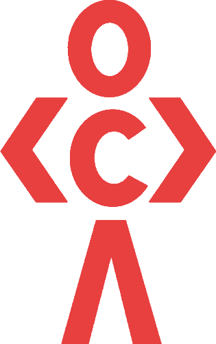

    
      
    <h1><code>Projects for everyone!</code></h1>
<h4>Official repository for codedamn hosted projects.</h4>

codedamn is a platform for developers, made by developers. Learning things in 21st century should be practical and interesting, and technology blended with eduction opens that dimension.

With codedamn, we aim to create a platform that could:

👉 Be used by anyone to get started with programming.

👉 Create a community experience to help others who are getting started.

👉 Monitor your own progress, learn and grow!

## 🚀 About Projects

codedamn Projects is an initiative to centralize and create highest quality collection of projects for people to to make. Learning by doing is super important, and creating fun and interactive projects is the best way to create those!

## How to use?

This GitHub repo hosts raw files for these projects. Please use [codedamn Projects page](https://codedamn.com/projects) for the best experience.

## How to contribute?

If you want to submit a project you created, create a [Pull Request](https://github.com/codedamn/projects/pulls) following the template of project submission. Your project would aspire thousands of developers across the world. Thank you!
